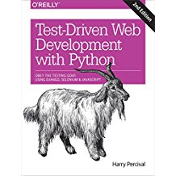

## 참조책 

--- 

---

## 마크다운 문법 
- https://namu.wiki/w/%EB%A7%88%ED%81%AC%EB%8B%A4%EC%9A%B4
* ~~test~~

## 파이썬 설치 
- [ 점프 투 파이썬 ](https://wikidocs.net/8)
- [ pip 설치 ] (http://blog.colab.kr/11)
- [ virtualenv 가상환경 구축 ](http://pythoninreal.blogspot.kr/2013/12/virtualenv.html)

## 파이썬 install
- virtualenv -p python3.4 .
---
 

- pip install django==1.10
- pip install --upgrade selenium
    - /dev_testdriven_django/안에 아래와 같은 파일이 생성 
        - selenium/webdriver/firefox/..
        - selenium/webdriver/remote/..
    - source 안에 webdriver 생성 후 chromedriver 복사 
    - 샘플코드 : /source/install_test/functional_test.py
---
- /dev_tstdriven_django/
    - django-admin.py startproject superlists 하여 메인프로젝트 생성
    - superlists를 source 로 프로젝트 이름 변경 
---     

### git (page8)
- echo "# dev_testdriven_django" >> README.md
- git init
- git add README.md
- git commit -m "first commit"
- git remote add origin git@github.com:lux600/dev_testdriven_django.git
- git push -u origin master

 
- git log --oneline  (한줄씩 보기)
 
---
- http://www.nltk.org/install.html
    - pip install -U nltk
    - pip install -U numpy 

# 가상환경 
- source bin/activate

## logging 설정 
http://ourcstory.tistory.com/97

## nltk
- https://stackoverflow.com/questions/26570944/resource-utokenizers-punkt-english-pickle-not-found/26578793
